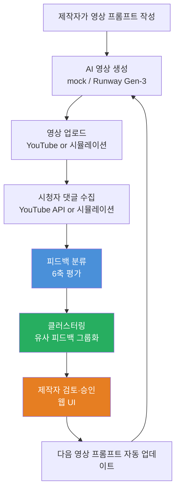
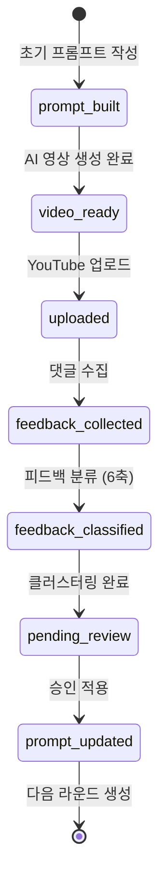
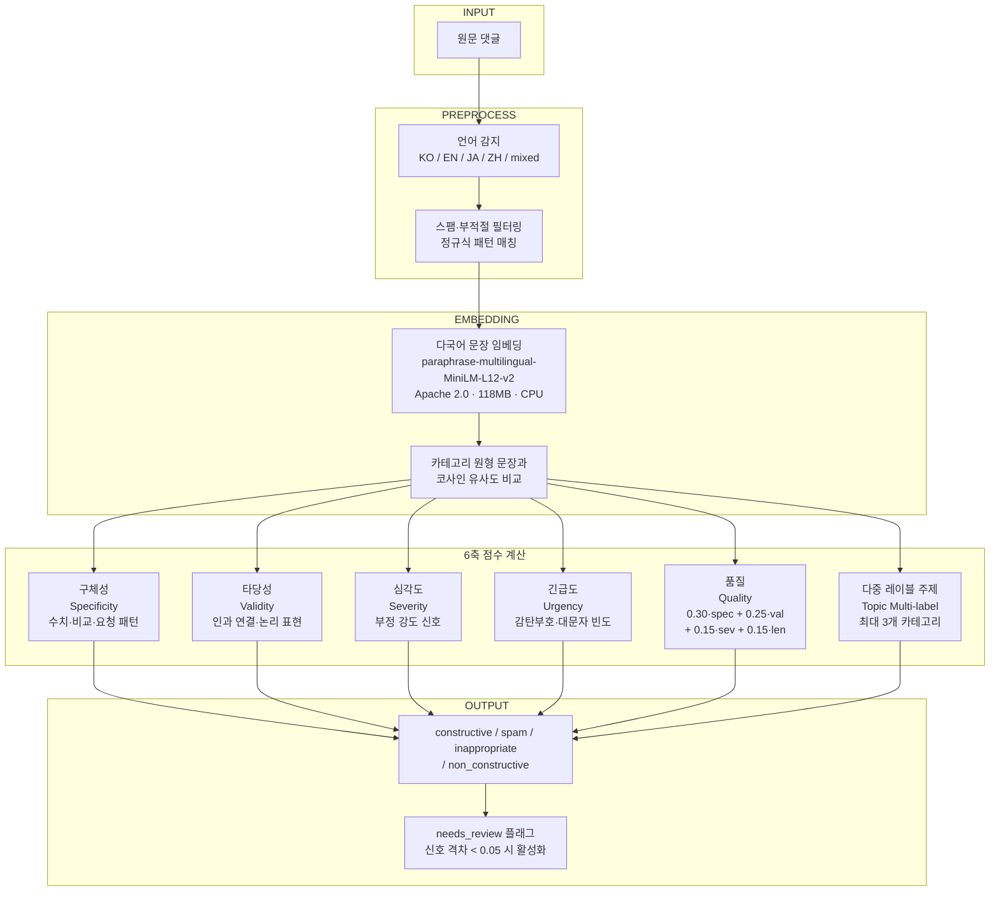
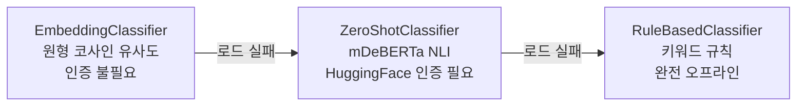
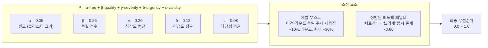
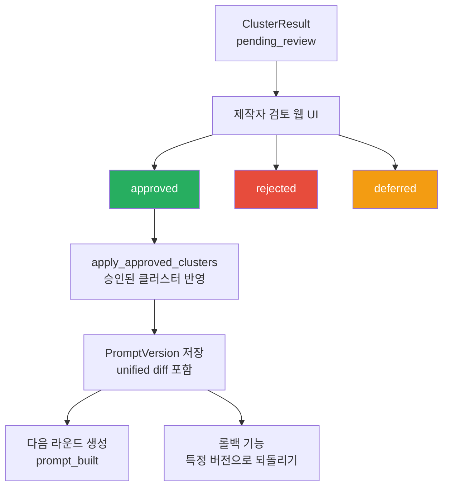
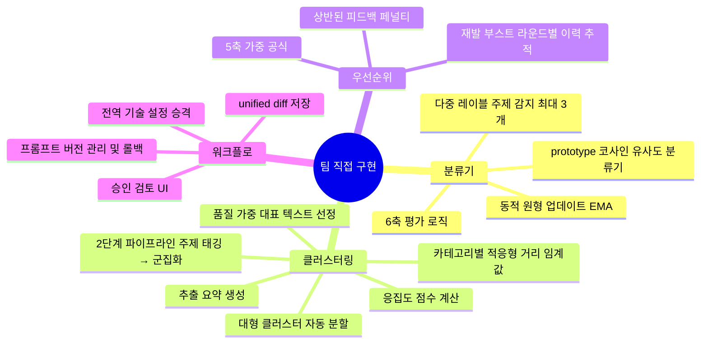

# AI 영상 피드백 자동 개선 시스템

> 시청자 댓글 → 건설적 피드백 추출 → 자동 군집화 → 프롬프트 반영  
> 외부 계정·GPU 없이 로컬 CPU에서 완전 동작하는 엔드-투-엔드 파이프라인

---

## 1. 시스템 개요

**핵심 가치**: 수백 개 댓글 중 실제로 반영할 만한 피드백만 추려 다음 영상에 자동 적용 → 제작자의 반복 수작업 제거

---

## 2. 파이프라인 상태 머신

각 단계는 Flask 라우트 POST 요청으로 전환. DB에 상태 저장 → 새로고침해도 진행 상태 유지.

---

## 3. 피드백 분류 파이프라인 (6축 평가)

### 폴백 체인

---

## 4. 클러스터링 파이프라인

---

## 5. 우선순위 산정 공식 (5축)

---

## 6. 승인 워크플로 및 프롬프트 버전 관리

---

## 7. 기술 스택 및 모델

| 구분 | 기술/모델 | 라이선스 | 크기 | 인증 |
|------|-----------|---------|------|------|
| 피드백 분류 | paraphrase-multilingual-MiniLM-L12-v2 | Apache 2.0 | 118MB | 불필요 |
| 문장 임베딩 | paraphrase-multilingual-mpnet-base-v2 | Apache 2.0 | 278MB | 불필요 |
| 군집화 (기본) | HDBSCAN 0.8.x | BSD | - | 불필요 |
| 군집화 (폴백) | sklearn AgglomerativeClustering | BSD | - | 불필요 |
| 백엔드 | Python 3.11, Flask 3.x, SQLAlchemy | - | - | - |
| 프론트엔드 | Bootstrap 5, Chart.js | MIT | - | - |
| AI 영상 생성 | Runway Gen-3 Alpha Turbo (또는 mock) | 상용 | - | API 키 |
| 프롬프트 생성 | Claude API (또는 템플릿 폴백) | 상용 | - | API 키 |

**모든 핵심 기능은 로컬 CPU에서 실행 — GPU 불필요, 외부 계정 불필요**

---

## 8. 직접 설계·구현한 핵심 모듈

---

## 9. 구현 완성도

| 기능 | 상태 |
|------|------|
| 피드백 수집 (시뮬레이션 / YouTube API) | ✅ 완료 |
| 6축 피드백 분류 | ✅ 완료 |
| HDBSCAN + 적응형 임계값 클러스터링 | ✅ 완료 |
| 5축 우선순위 산정 (재발 부스트·페널티 포함) | ✅ 완료 |
| 클러스터 응집도·요약 자동 생성 | ✅ 완료 |
| 제작자 검토 웹 UI | ✅ 완료 |
| 프롬프트 버전 관리 + 롤백 | ✅ 완료 |
| 분석 리포트 (Chart.js) | ✅ 완료 |
| Runway Gen-3 영상 생성 어댑터 | ✅ 완료 |
| Kling 영상 생성 어댑터 | 🔲 미구현 |
| 실제 YouTube 업로드 연동 | 🔲 미테스트 |
