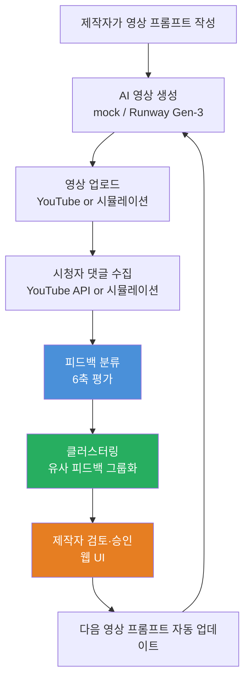
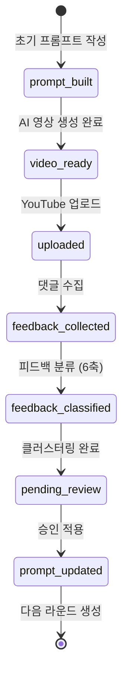
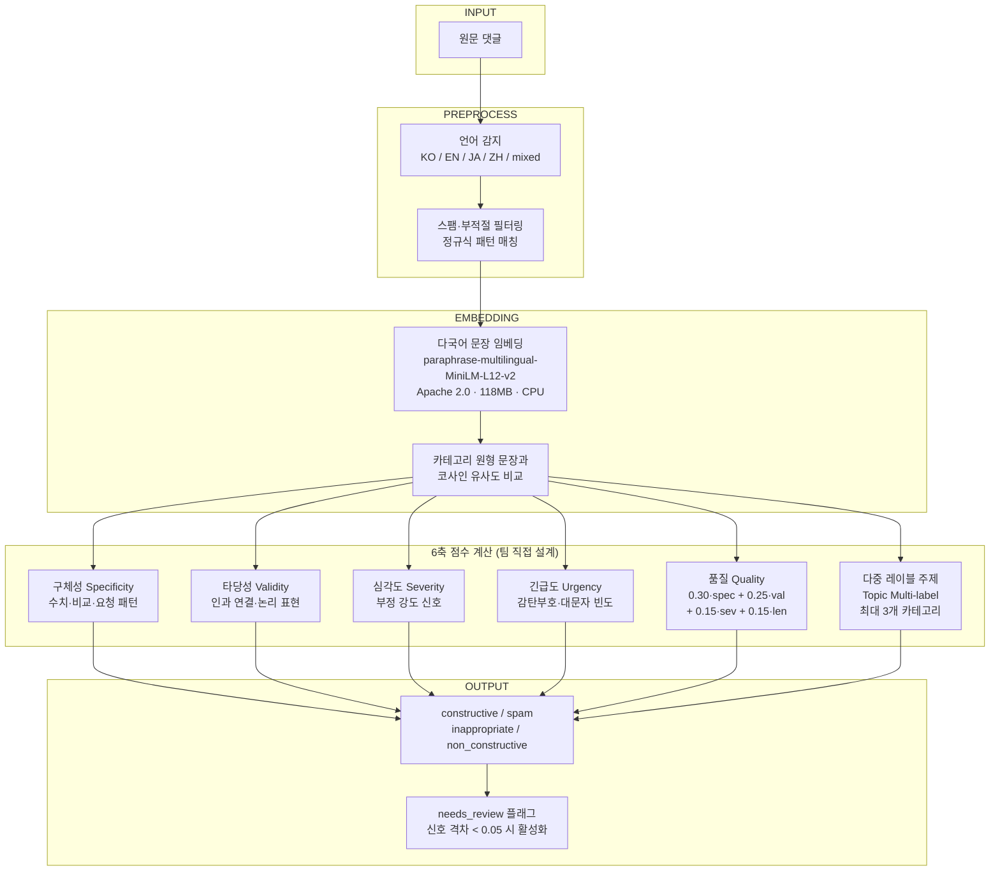
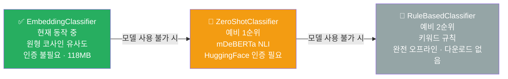
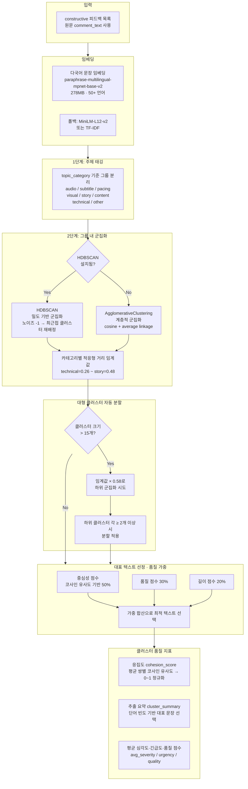
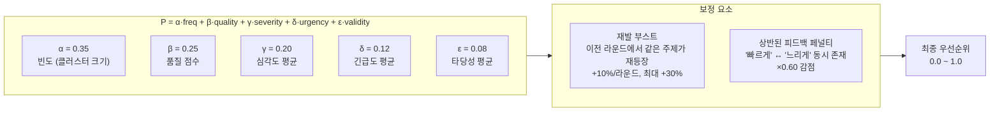
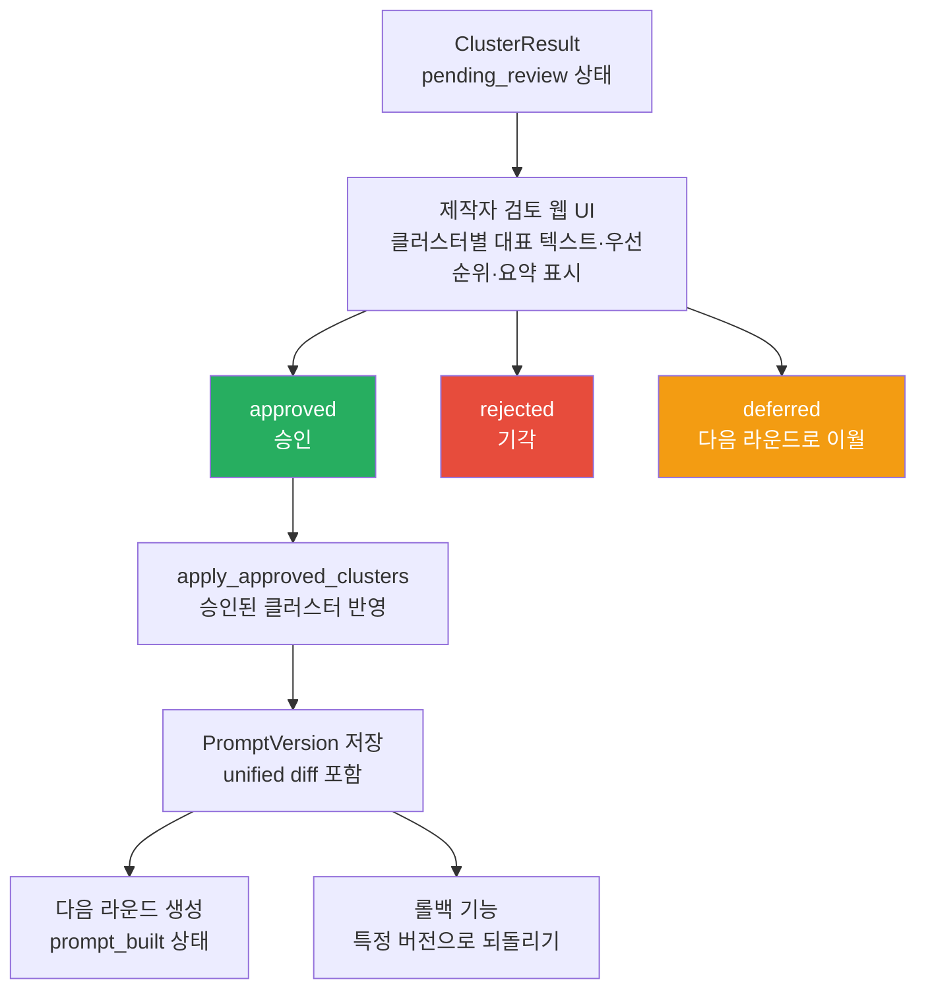
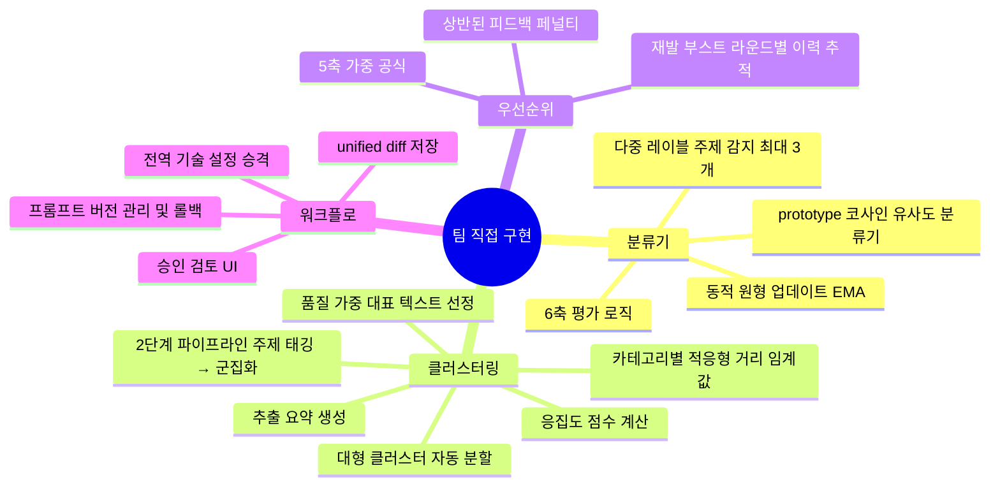

# AI 영상 피드백 자동 개선 시스템

> 시청자 댓글 → 건설적 피드백 추출 → 자동 군집화 → 프롬프트 반영  
> 외부 계정·GPU 없이 로컬 CPU에서 완전 동작하는 엔드-투-엔드 파이프라인

---

## 1. 시스템 개요

유튜브 등 영상 플랫폼에서 수백 개의 댓글이 달려도 제작자가 일일이 읽고 반영하기란 현실적으로 어렵습니다. 이 시스템은 댓글을 자동으로 분석해 "다음 영상에 실제로 반영할 만한 피드백"만 추려내고, 제작자가 클릭 몇 번으로 승인하면 다음 영상 프롬프트에 자동 적용되는 파이프라인입니다.

**핵심 가치**: 수백 개 댓글 중 실제로 반영할 만한 피드백만 추려 다음 영상에 자동 적용 → 제작자의 반복 수작업 제거

---

## 2. 파이프라인 상태 머신

시스템 전체 흐름은 7단계 상태 머신으로 관리됩니다. 각 단계는 Flask 라우트의 POST 요청으로 전환되며, SQLite DB에 상태가 저장되어 새로고침하거나 서버를 재시작해도 진행 상태가 유지됩니다. 한 번의 피드백 수집~반영 사이클을 "라운드(round)"라 부르며, 라운드가 완료되면 자동으로 다음 라운드가 생성됩니다.

---

## 3. 피드백 분류 파이프라인 (6축 평가)

댓글 하나를 받아 건설적(constructive) 피드백인지 판별하고, 6가지 축으로 점수를 매깁니다. 단순히 긍정/부정을 판별하는 것이 아니라, "이 댓글이 다음 영상 제작에 실제로 도움이 되는가"를 정량화하는 것이 핵심입니다.

- **구체성(Specificity)**: 수치, 비교 표현, 명시적 요청이 포함되어 있는가
- **타당성(Validity)**: 인과 관계와 논리적 근거가 있는가
- **심각도(Severity)**: 문제의 강도 — 불편함인지 치명적 결함인지
- **긴급도(Urgency)**: 즉시 수정이 필요한지, 감탄부호·대문자 빈도 등으로 감지
- **품질(Quality)**: 위 4개 축을 종합한 피드백 신뢰도 지표
- **다중 레이블 주제(Topic Multi-label)**: 하나의 댓글이 audio+pacing 같이 복수 주제를 언급할 수 있어 최대 3개 카테고리를 동시에 태깅

### 현재 동작 중인 분류기 및 예비 체계

분류기는 우선순위 순으로 3단계 예비 체계를 갖춥니다. **현재는 EmbeddingClassifier가 항상 정상 동작**하며, 아래 두 분류기는 모델 다운로드 실패 등 예외 상황에 대비한 안전망입니다.

---

## 4. 클러스터링 파이프라인

건설적으로 분류된 피드백들을 "같은 주제·같은 문제를 말하는 댓글끼리" 묶는 단계입니다. 단순히 텍스트 유사도로 묶으면 "음질이 나쁘다"와 "자막이 잘못됐다"가 함께 묶이는 문제가 생깁니다. 이를 해결하기 위해 **2단계 파이프라인**(주제 태깅 → 태그 내 군집화)을 직접 설계했습니다.

또한 카테고리마다 댓글 표현 방식이 다릅니다. 기술 이슈("인코딩 오류")는 매우 구체적이라 좁게 묶어야 하고, 스토리("전개가 느린 것 같아요")는 다양한 표현이 나오므로 넓게 묶어야 합니다. 이를 위해 **카테고리별 적응형 거리 임계값**을 설계했습니다.

**카테고리별 적응형 거리 임계값 설계 근거**

| 카테고리 | 임계값 | 이유 |
|---------|--------|------|
| technical | 0.26 | 기술 이슈는 표현이 구체적 → 좁게 묶어야 세분화 가능 |
| subtitle | 0.30 | 자막 오류도 비교적 구체적 표현 |
| audio | 0.38 | 음질 표현은 다소 다양 |
| visual | 0.36 | 화면 표현은 중간 수준 |
| pacing | 0.42 | "빠르다/느리다" 등 표현 다양 |
| content | 0.44 | 내용 관련 표현 매우 다양 |
| story | 0.48 | 스토리 감상은 주관적 표현이 넓음 |

---

## 5. 우선순위 산정 공식 (5축)

클러스터링으로 그룹화된 피드백들 중 "어떤 것을 먼저 반영할 것인가"를 정량적으로 결정합니다. 단순 빈도(많이 언급된 순)만으로 순위를 매기면 심각한 문제라도 언급 수가 적으면 묻히는 문제가 있습니다. 이를 해결하기 위해 5가지 축을 결합한 가중 공식을 직접 설계했습니다.

v1에서는 빈도(α=0.60)·타당성(β=0.40)만 사용했으나, v2에서 품질·심각도·긴급도를 추가해 빈도 의존도를 낮췄습니다.

**재발 부스트**: 이전 라운드에서 이미 지적됐지만 반영되지 않은 이슈가 다시 등장하면 자동으로 우선순위가 올라갑니다. "같은 불만이 계속 나온다"는 신호를 수치로 반영한 설계입니다.

**상반된 피드백 페널티**: "편집이 너무 빠르다"와 "편집이 너무 느리다"가 동시에 같은 클러스터에 존재하면, 어느 방향으로 수정해도 절반은 만족하지 못하므로 우선순위를 낮춥니다.

---

## 6. 승인 워크플로 및 프롬프트 버전 관리

자동으로 도출된 피드백 클러스터를 제작자가 최종 검토하는 단계입니다. 완전 자동화 대신 "제작자의 최종 판단"을 시스템에 포함한 이유는, 알고리즘이 놓칠 수 있는 맥락(채널 방향성, 특수 기획 의도 등)을 보존하기 위해서입니다.

승인된 클러스터는 Claude API(없으면 템플릿)를 통해 프롬프트에 자동 반영되며, 모든 변경 이력은 unified diff 형식으로 저장되어 언제든 특정 버전으로 롤백할 수 있습니다.

---

## 7. 기술 스택 및 모델

모든 핵심 기능은 **로컬 CPU에서 실행**됩니다. GPU 불필요, 외부 계정 불필요(영상 생성 API 제외).

| 구분 | 기술/모델 | 라이선스 | 크기 | 인증 |
|------|-----------|---------|------|------|
| 피드백 분류 (현재 동작) | paraphrase-multilingual-MiniLM-L12-v2 | Apache 2.0 | 118MB | 불필요 |
| 문장 임베딩 | paraphrase-multilingual-mpnet-base-v2 | Apache 2.0 | 278MB | 불필요 |
| 군집화 (우선) | HDBSCAN 0.8.x | BSD | — | 불필요 |
| 군집화 (예비) | sklearn AgglomerativeClustering | BSD | — | 불필요 |
| 백엔드 | Python 3.11, Flask 3.x, SQLAlchemy (SQLite) | — | — | — |
| 프론트엔드 | Bootstrap 5, Chart.js | MIT | — | — |
| AI 영상 생성 | Runway Gen-3 Alpha Turbo (또는 mock) | 상용 | — | API 키 |
| 프롬프트 생성 | Claude API (또는 템플릿 폴백) | 상용 | — | API 키 |

---

## 8. 직접 설계·구현한 핵심 모듈

오픈소스 라이브러리(임베딩 모델, HDBSCAN, sklearn 등)는 기반 도구로 활용하고, 아래 핵심 로직은 팀이 직접 설계·구현했습니다.

---

## 9. 구현 완성도

| 기능 | 상태 |
|------|------|
| 피드백 수집 (시뮬레이션 / YouTube API) | ✅ 완료 |
| 6축 피드백 분류 | ✅ 완료 |
| HDBSCAN + 적응형 임계값 클러스터링 | ✅ 완료 |
| 5축 우선순위 산정 (재발 부스트·페널티 포함) | ✅ 완료 |
| 클러스터 응집도·요약 자동 생성 | ✅ 완료 |
| 제작자 검토 웹 UI | ✅ 완료 |
| 프롬프트 버전 관리 + 롤백 | ✅ 완료 |
| 분석 리포트 (Chart.js) | ✅ 완료 |
| Runway Gen-3 영상 생성 어댑터 | ✅ 완료 |
| Kling 영상 생성 어댑터 | 🔲 미구현 |
| 실제 YouTube 업로드 연동 | 🔲 미테스트 |
