# AI 영상 피드백 자동 개선 시스템

> 시청자 댓글 → 건설적 피드백 추출 → 자동 군집화 → 프롬프트 반영  
> 외부 계정·GPU 없이 로컬 CPU에서 완전 동작하는 엔드-투-엔드 파이프라인

---

## 1. 시스템 개요

유튜브 등 영상 플랫폼에서 수백 개의 댓글이 달려도 제작자가 일일이 읽고 반영하기란 현실적으로 어렵습니다. 이 시스템은 댓글을 자동으로 분석해 "다음 영상에 실제로 반영할 만한 피드백"만 추려내고, 제작자가 클릭 몇 번으로 승인하면 다음 영상 프롬프트에 자동 적용되는 파이프라인입니다.

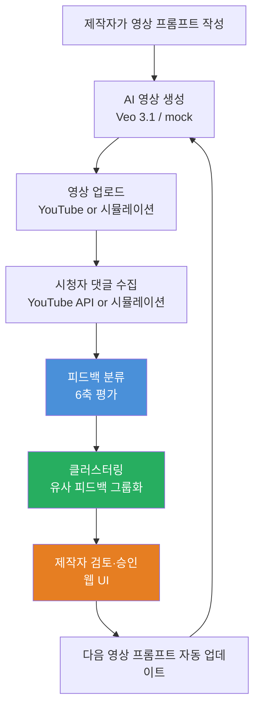
```mermaid
flowchart TD
    A[제작자가 영상 프롬프트 작성] --> B[AI 영상 생성\nVeo 3.1 / mock]
    B --> C[영상 업로드\nYouTube or 시뮬레이션]
    C --> D[시청자 댓글 수집\nYouTube API or 시뮬레이션]
    D --> E[피드백 분류\n6축 평가]
    E --> F[클러스터링\n유사 피드백 그룹화]
    F --> G[제작자 검토·승인\n웹 UI]
    G --> H[다음 영상 프롬프트 자동 업데이트]
    H --> B

    style E fill:#4A90D9,color:#fff
    style F fill:#27AE60,color:#fff
    style G fill:#E67E22,color:#fff
```

**핵심 가치**: 수백 개 댓글 중 실제로 반영할 만한 피드백만 추려 다음 영상에 자동 적용 → 제작자의 반복 수작업 제거

---

## 2. 시스템 아키텍처 블록도

시스템은 5개 계층으로 구성됩니다. 각 계층은 인터페이스가 명확하게 분리되어 있으며, 외부 API가 없어도 폴백 체인으로 모든 기능이 동작합니다.

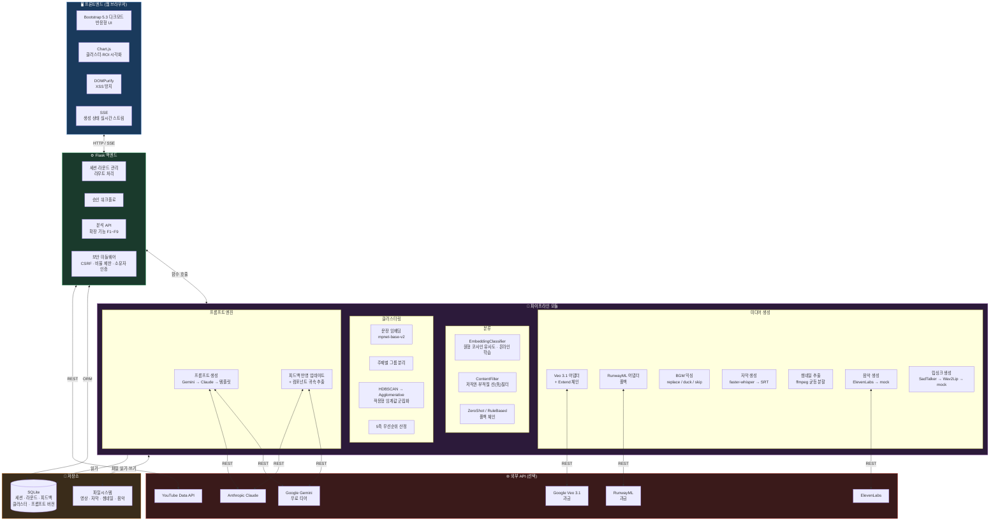
```mermaid
flowchart TB
    subgraph BROWSER["🖥️  프론트엔드 (웹 브라우저)"]
        direction LR
        UI1["Bootstrap 5.3 다크모드\n반응형 UI"]
        UI2["Chart.js\n클러스터·ROI 시각화"]
        UI3["DOMPurify\nXSS 방지"]
        UI4["SSE\n생성 상태 실시간 스트림"]
    end

    subgraph FLASK["⚙️  Flask 백엔드"]
        direction LR
        R1["세션·라운드 관리\n라우트 처리"]
        R2["승인 워크플로"]
        R3["분석 API\n확장 기능 F1~F9"]
        SEC["보안 미들웨어\nCSRF · 비율 제한 · 소유자 인증"]
    end

    subgraph PIPELINE["🔧  파이프라인 모듈"]
        direction TB
        subgraph CLS["분류"]
            C1["EmbeddingClassifier\n원형 코사인 유사도 · 온라인 학습"]
            C2["ContentFilter\n저작권·부적절 선(先)필터"]
            C3["ZeroShot / RuleBased\n폴백 체인"]
        end
        subgraph CLU["클러스터링"]
            CL1["문장 임베딩\nmpnet-base-v2"]
            CL2["주제별 그룹 분리"]
            CL3["HDBSCAN → Agglomerative\n적응형 임계값 군집화"]
            CL4["5축 우선순위 산정"]
        end
        subgraph MEDIA["미디어 생성"]
            G1["Veo 3.1 어댑터\n+ Extend 체인"]
            G2["RunwayML 어댑터\n폴백"]
            G3["BGM 믹싱\nreplace / duck / skip"]
            G4["자막 생성\nfaster-whisper → SRT"]
            G5["썸네일 추출\nffmpeg 균등 분할"]
            G6["음악 생성\nElevenLabs → mock"]
            G7["립싱크 생성\nSadTalker → Wav2Lip → mock"]
        end
        subgraph PROMPT["프롬프트 엔진"]
            P1["프롬프트 생성\nGemini → Claude → 템플릿"]
            P2["피드백 반영 업데이트\n+ 컴포넌트 귀속 추출"]
        end
    end

    subgraph STORAGE["💾  저장소"]
        DB[("SQLite\n세션 · 라운드 · 피드백\n클러스터 · 프롬프트 버전")]
        FS["파일시스템\n영상 · 자막 · 썸네일 · 음악"]
    end

    subgraph EXTAPI["🌐  외부 API (선택)"]
        direction LR
        EA1["Google Veo 3.1\n과금"]
        EA2["Google Gemini\n무료 티어"]
        EA3["Anthropic Claude"]
        EA4["ElevenLabs"]
        EA5["RunwayML\n과금"]
        EA6["YouTube Data API"]
    end

    BROWSER <-->|"HTTP / SSE"| FLASK
    FLASK <-->|"함수 호출"| PIPELINE
    FLASK <-->|"ORM"| DB
    PIPELINE <-->|"파일 읽기·쓰기"| FS
    PIPELINE -->|"읽기"| DB

    G1 <-->|"REST"| EA1
    G2 <-->|"REST"| EA5
    P1 & P2 <-->|"REST"| EA2
    P1 & P2 <-->|"REST"| EA3
    G6 <-->|"REST"| EA4
    FLASK <-->|"REST"| EA6

    style BROWSER fill:#1a3a5c,color:#fff,stroke:#4A90D9
    style FLASK fill:#1a3a2c,color:#fff,stroke:#27AE60
    style PIPELINE fill:#2c1a3a,color:#fff,stroke:#9B59B6
    style STORAGE fill:#3a2c1a,color:#fff,stroke:#E67E22
    style EXTAPI fill:#3a1a1a,color:#fff,stroke:#E74C3C
```

### 계층별 책임 요약

| 계층 | 주요 책임 | 외부 의존 |
|------|----------|----------|
| 프론트엔드 | UI 렌더링, XSS 방지, 실시간 상태 수신 | CDN (Bootstrap, Chart.js, DOMPurify) |
| Flask 백엔드 | 라우팅, 보안, 상태 관리, API 조율 | 없음 |
| 파이프라인 | 분류·군집화·생성·프롬프트 로직 | 로컬 모델 (자동 다운로드) |
| 저장소 | 영속성, 파일 서빙 | 없음 (로컬) |
| 외부 API | 영상·텍스트·음악 생성 | API 키 필요 (없으면 mock 폴백) |

---

## 3. 파이프라인 상태 머신

시스템 전체 흐름은 8단계 상태 머신으로 관리됩니다. 각 단계는 Flask 라우트의 POST 요청으로 전환되며, SQLite DB에 상태가 저장되어 새로고침하거나 서버를 재시작해도 진행 상태가 유지됩니다. 한 번의 피드백 수집~반영 사이클을 "라운드(round)"라 부르며, 라운드가 완료되면 자동으로 다음 라운드가 생성됩니다.

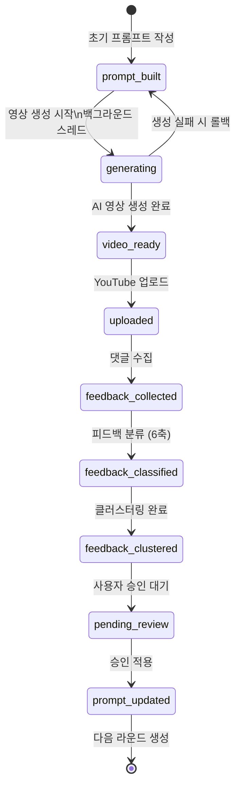
```mermaid
stateDiagram-v2
    [*] --> prompt_built : 초기 프롬프트 작성
    prompt_built --> generating : 영상 생성 시작\n백그라운드 스레드
    generating --> video_ready : AI 영상 생성 완료
    generating --> prompt_built : 생성 실패 시 롤백
    video_ready --> uploaded : YouTube 업로드
    uploaded --> feedback_collected : 댓글 수집
    feedback_collected --> feedback_classified : 피드백 분류 (6축)
    feedback_classified --> feedback_clustered : 클러스터링 완료
    feedback_clustered --> pending_review : 사용자 승인 대기
    pending_review --> prompt_updated : 승인 적용
    prompt_updated --> [*] : 다음 라운드 생성
```

**좀비 복구**: 서버 재시작 시 `generating` 상태로 멈춘 라운드를 자동으로 `prompt_built`으로 복구합니다.

---

## 4. 영상 생성 프롬프트 파이프라인

AI 영상 생성 API(Veo 3.1 등)는 자유형식 문장보다 **의미 단위로 구조화된 컴포넌트**에 훨씬 정확하게 반응합니다. 구조화하면 피드백 반영도 정밀해집니다. "카메라가 흔들린다"는 지적은 `camera` 컴포넌트만 수정하면 되기 때문입니다.

### 6+1 컴포넌트 구조

| 컴포넌트 | 설명 | 예시 |
|---------|------|------|
| `subject` | 주체/인물 묘사 | `A young woman in a red dress` |
| `motion` | 동작/움직임 | `walking confidently through crowds` |
| `camera` | 카메라 무빙·샷 타입 | `slow tracking shot from behind` |
| `setting` | 환경/배경·시간대 | `busy Seoul street at golden hour` |
| `style` | 조명·색감·해상도 | `cinematic 4K, shallow depth of field` |
| `audio` | 배경음악·음향 (싱잉홍보영상 전용) | `catchy jingle, upbeat vocals, 100-120 BPM` |
| `negative` | 생성 금지 요소 | `shaky camera, text overlays, watermarks` |

조합 순서: `{subject}, {motion}, {camera}, {setting}, {style}. Negative: {negative}`

### 프롬프트 구성 흐름

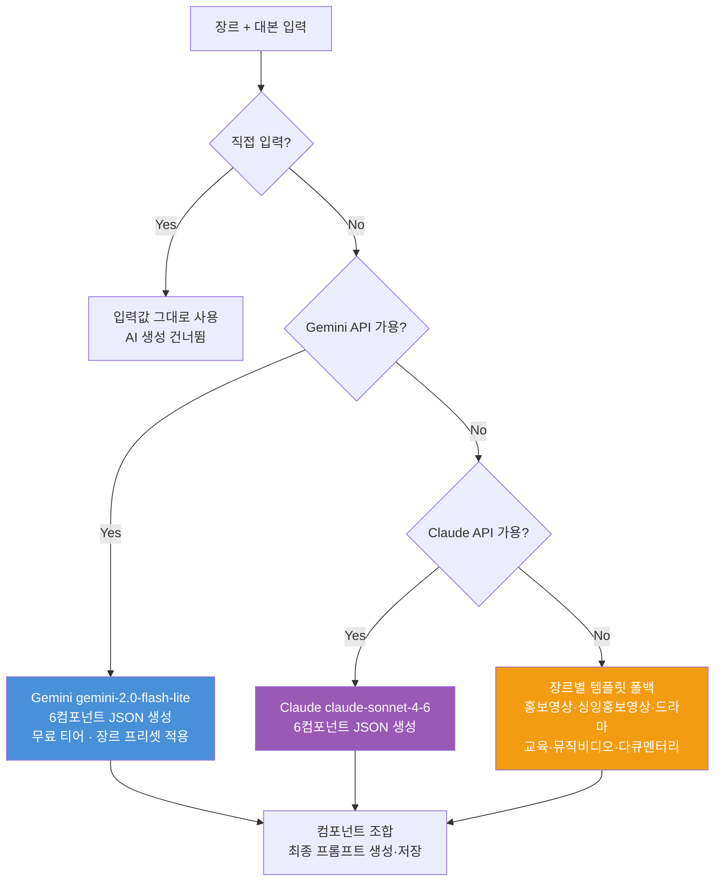
```mermaid
flowchart TD
    A[장르 + 대본 입력] --> M{직접 입력?}
    M -->|Yes| Z[입력값 그대로 사용\nAI 생성 건너뜀]
    M -->|No| B{Gemini API 가용?}
    B -->|Yes| C[Gemini gemini-2.0-flash-lite\n6컴포넌트 JSON 생성\n무료 티어 · 장르 프리셋 적용]
    B -->|No| D{Claude API 가용?}
    D -->|Yes| E[Claude claude-sonnet-4-6\n6컴포넌트 JSON 생성]
    D -->|No| F[장르별 템플릿 폴백\n홍보영상·싱잉홍보영상·드라마\n교육·뮤직비디오·다큐멘터리]
    C & E & F --> G[컴포넌트 조합\n최종 프롬프트 생성·저장]
    style C fill:#4A90D9,color:#fff
    style E fill:#9B59B6,color:#fff
    style F fill:#F39C12,color:#fff
```

### Veo 3.1 어댑터 — 3단계 안전 파이프라인

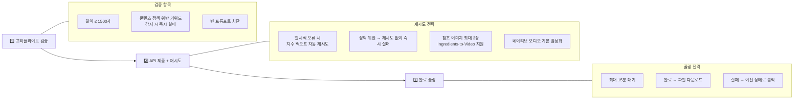
```mermaid
flowchart LR
    A["1️⃣ 프리플라이트 검증"] --> B["2️⃣ API 제출 + 재시도"] --> C["3️⃣ 완료 폴링"]

    subgraph VA["검증 항목"]
        A1[길이 ≤ 1500자]
        A2[콘텐츠 정책 위반 키워드\n감지 시 즉시 실패]
        A3[빈 프롬프트 차단]
    end

    subgraph VB["재시도 전략"]
        B1[일시적 오류 시\n지수 백오프 자동 재시도]
        B2[정책 위반 → 재시도 없이 즉시 실패]
        B3[참조 이미지 최대 3장\nIngredients-to-Video 지원]
        B4[네이티브 오디오 기본 활성화]
    end

    subgraph VC["폴링 전략"]
        C1[최대 15분 대기]
        C2[완료 → 파일 다운로드]
        C3[실패 → 이전 상태로 롤백]
    end

    A --- VA
    B --- VB
    C --- VC
```

### Veo Extend — 긴 영상 자동 연장

`목표 길이 > 8초` 설정 시 베이스 8초 클립을 7초씩 반복 연장합니다.

| 목표 길이 | 실제 길이 | 연장 횟수 | 비용 (Fast 기준) |
|---------|---------|----------|----------------|
| 8초 (기본) | ~8초 | 0회 (단일 클립) | ~$0.64 |
| 30초 | ~36초 | 4회 | ~$2.88 |
| 60초 | ~64초 | 8회 | ~$5.12 |

- 연장 실패 시 현재까지 결과 반환 (graceful degradation)
- 연장 성공마다 이전 중간 파일 자동 삭제 → 최종본 1개만 유지
- 연장 구간은 720p 전용, 8회(~64초) 이후 색감·조명 드리프트 주의

### 어댑터별 비교

| 항목 | Veo 3.1 (기본 권장) | RunwayML (대체) | mock (개발용) |
|------|------------------|--------------|------------|
| 비용 | $0.08/초 | $0.05/초 | 무료 |
| 최대 영상 | ~148초 (Extend) | ~10분 | 즉시 반환 |
| 네이티브 오디오 | 지원 | 미지원 | 미지원 |
| 일일 안전장치 | 한도 초과 시 mock 자동 폴백 | 동일 | — |

---

## 5. 피드백 분류 파이프라인 (6축 평가)

댓글 하나를 받아 건설적(constructive) 피드백인지 판별하고, 6가지 축으로 점수를 매깁니다. 단순히 긍정/부정을 판별하는 것이 아니라, "이 댓글이 다음 영상 제작에 실제로 도움이 되는가"를 정량화하는 것이 핵심입니다.

- **구체성(Specificity)**: 수치, 비교 표현, 명시적 요청이 포함되어 있는가
- **타당성(Validity)**: 인과 관계와 논리적 근거가 있는가
- **심각도(Severity)**: 문제의 강도 — 불편함인지 치명적 결함인지
- **긴급도(Urgency)**: 즉시 수정이 필요한지, 감탄부호·대문자 빈도 등으로 감지
- **품질(Quality)**: 위 4개 축을 종합한 피드백 신뢰도 지표
- **다중 레이블 주제(Topic Multi-label)**: 하나의 댓글이 audio+pacing 같이 복수 주제를 언급할 수 있어 최대 3개 카테고리를 동시에 태깅

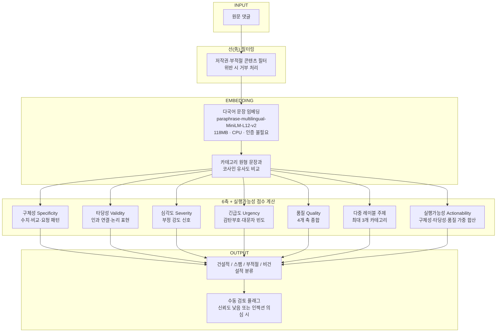
```mermaid
flowchart TD
    subgraph INPUT
        A[원문 댓글]
    end

    subgraph PREFILTER["선(先) 필터링"]
        P[저작권·부적절 콘텐츠 필터\n위반 시 거부 처리]
    end

    subgraph EMBEDDING
        D[다국어 문장 임베딩\nparaphrase-multilingual-MiniLM-L12-v2\n118MB · CPU · 인증 불필요]
        E[카테고리 원형 문장과\n코사인 유사도 비교]
    end

    subgraph SIX_AXIS["6축 + 실행가능성 점수 계산"]
        F1[구체성 Specificity\n수치·비교·요청 패턴]
        F2[타당성 Validity\n인과 연결·논리 표현]
        F3[심각도 Severity\n부정 강도 신호]
        F4[긴급도 Urgency\n감탄부호·대문자 빈도]
        F5[품질 Quality\n4개 축 종합]
        F6[다중 레이블 주제\n최대 3개 카테고리]
        F7[실행가능성 Actionability\n구체성·타당성·품질 가중 합산]
    end

    subgraph OUTPUT
        G1[건설적 / 스팸 / 부적절 / 비건설적 분류]
        G2[수동 검토 플래그\n신뢰도 낮음 또는 인젝션 의심 시]
    end

    A --> P --> D --> E
    E --> F1 & F2 & F3 & F4 & F5 & F6 & F7
    F1 & F2 & F3 & F4 & F5 & F6 & F7 --> G1 --> G2
```

### 분류기 폴백 체계

분류기는 우선순위 순으로 3단계 예비 체계를 갖춥니다. **현재는 EmbeddingClassifier가 항상 정상 동작**하며, 아래 두 분류기는 모델 다운로드 실패 등 예외 상황에 대비한 안전망입니다.

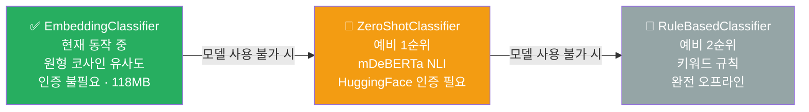
```mermaid
flowchart LR
    A["✅ EmbeddingClassifier\n현재 동작 중\n원형 코사인 유사도\n인증 불필요 · 118MB"]
    B["🔁 ZeroShotClassifier\n예비 1순위\nmDeBERTa NLI\nHuggingFace 인증 필요"]
    C["🔁 RuleBasedClassifier\n예비 2순위\n키워드 규칙\n완전 오프라인"]

    A -->|모델 사용 불가 시| B
    B -->|모델 사용 불가 시| C

    style A fill:#27AE60,color:#fff
    style B fill:#F39C12,color:#fff
    style C fill:#95A5A6,color:#fff
```

**간접 프롬프트 인젝션 방어**: 시청자 댓글은 신뢰할 수 없는 외부 입력이므로, LLM 호출 시 반드시 지시문과 분리된 XML 태그로 격리합니다. 승인 전에는 의심 패턴을 자동 탐지해 수동 검토 플래그를 설정합니다.

---

## 6. 클러스터링 파이프라인

건설적으로 분류된 피드백들을 "같은 주제·같은 문제를 말하는 댓글끼리" 묶는 단계입니다. 단순히 텍스트 유사도로 묶으면 "음질이 나쁘다"와 "자막이 잘못됐다"가 함께 묶이는 문제가 생깁니다. 이를 해결하기 위해 **2단계 파이프라인**(주제 태깅 → 태그 내 군집화)을 직접 설계했습니다.

또한 카테고리마다 댓글 표현 방식이 다릅니다. 기술 이슈("인코딩 오류")는 매우 구체적이라 좁게 묶어야 하고, 스토리("전개가 느린 것 같아요")는 다양한 표현이 나오므로 넓게 묶어야 합니다. 이를 위해 **카테고리별 적응형 거리 임계값**을 설계했습니다.

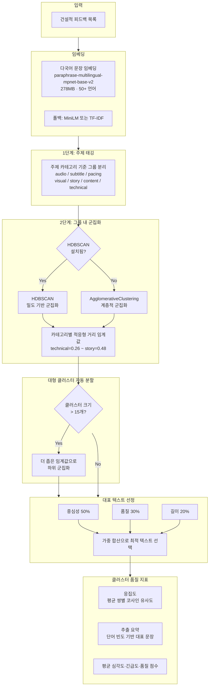
```mermaid
flowchart TD
    subgraph INPUT2[입력]
        I1[건설적 피드백 목록]
    end

    subgraph EMBED2[임베딩]
        E1[다국어 문장 임베딩\nparaphrase-multilingual-mpnet-base-v2\n278MB · 50+ 언어]
        E2[폴백: MiniLM 또는 TF-IDF]
    end

    subgraph TOPIC[1단계: 주제 태깅]
        T1[주제 카테고리 기준 그룹 분리\naudio / subtitle / pacing\nvisual / story / content / technical]
    end

    subgraph CLUSTER[2단계: 그룹 내 군집화]
        C1{HDBSCAN\n설치됨?}
        C2[HDBSCAN\n밀도 기반 군집화]
        C3[AgglomerativeClustering\n계층적 군집화]
        C4[카테고리별 적응형 거리 임계값\ntechnical=0.26 ~ story=0.48]
    end

    subgraph SUBCLUSTER[대형 클러스터 자동 분할]
        S1{클러스터 크기\n> 15개?}
        S2[더 좁은 임계값으로\n하위 군집화]
    end

    subgraph REPRESENT[대표 텍스트 선정]
        R1[중심성 50%]
        R2[품질 30%]
        R3[길이 20%]
        R4[가중 합산으로 최적 텍스트 선택]
    end

    subgraph METRICS[클러스터 품질 지표]
        M1[응집도\n평균 쌍별 코사인 유사도]
        M2[추출 요약\n단어 빈도 기반 대표 문장]
        M3[평균 심각도·긴급도·품질 점수]
    end

    INPUT2 --> EMBED2 --> TOPIC --> C1
    C1 -->|Yes| C2
    C1 -->|No| C3
    C2 & C3 --> C4 --> S1
    S1 -->|Yes| S2 --> REPRESENT
    S1 -->|No| REPRESENT
    R1 & R2 & R3 --> R4 --> METRICS
```

**카테고리별 적응형 거리 임계값 설계 근거**

| 카테고리 | 임계값 | 이유 |
|---------|--------|------|
| technical | 0.26 | 기술 이슈는 표현이 구체적 → 좁게 묶어야 세분화 가능 |
| subtitle | 0.30 | 자막 오류도 비교적 구체적 표현 |
| audio | 0.38 | 음질 표현은 다소 다양 |
| visual | 0.36 | 화면 표현은 중간 수준 |
| pacing | 0.42 | "빠르다/느리다" 등 표현 다양 |
| content | 0.44 | 내용 관련 표현 매우 다양 |
| story | 0.48 | 스토리 감상은 주관적 표현이 넓음 |

---

## 7. 우선순위 산정 공식 (5축)

클러스터링으로 그룹화된 피드백들 중 "어떤 것을 먼저 반영할 것인가"를 정량적으로 결정합니다. 단순 빈도(많이 언급된 순)만으로 순위를 매기면 심각한 문제라도 언급 수가 적으면 묻히는 문제가 있습니다. 이를 해결하기 위해 5가지 축을 결합한 가중 공식을 직접 설계했습니다.

v1에서는 빈도·타당성 2개 축만 사용했으나, v2에서 품질·심각도·긴급도를 추가해 빈도 의존도를 낮췄습니다.

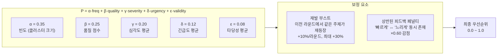
```mermaid
flowchart LR
    subgraph FORMULA["P = α·freq + β·quality + γ·severity + δ·urgency + ε·validity"]
        W1["α = 0.35\n빈도 (클러스터 크기)"]
        W2["β = 0.25\n품질 점수"]
        W3["γ = 0.20\n심각도 평균"]
        W4["δ = 0.12\n긴급도 평균"]
        W5["ε = 0.08\n타당성 평균"]
    end

    subgraph ADJUST[보정 요소]
        A1[재발 부스트\n이전 라운드에서 같은 주제가 재등장\n+10%/라운드, 최대 +30%]
        A2[상반된 피드백 페널티\n'빠르게' ↔ '느리게' 동시 존재\n×0.60 감점]
    end

    FORMULA --> ADJUST --> OUT[최종 우선순위\n0.0 ~ 1.0]
```

**재발 부스트**: 이전 라운드에서 이미 지적됐지만 반영되지 않은 이슈가 다시 등장하면 자동으로 우선순위가 올라갑니다. "같은 불만이 계속 나온다"는 신호를 수치로 반영한 설계입니다.

**상반된 피드백 페널티**: "편집이 너무 빠르다"와 "편집이 너무 느리다"가 동시에 같은 클러스터에 존재하면, 어느 방향으로 수정해도 절반은 만족하지 못하므로 우선순위를 낮춥니다.

---

## 8. 승인 워크플로 및 프롬프트 버전 관리

자동으로 도출된 피드백 클러스터를 제작자가 최종 검토하는 단계입니다. 완전 자동화 대신 "제작자의 최종 판단"을 시스템에 포함한 이유는, 알고리즘이 놓칠 수 있는 맥락(채널 방향성, 특수 기획 의도 등)을 보존하기 위해서입니다.

승인된 클러스터는 Gemini API(없으면 Claude API, 없으면 템플릿)를 통해 프롬프트에 자동 반영되며, 모든 변경 이력은 unified diff 형식으로 저장되어 언제든 특정 버전으로 롤백할 수 있습니다.

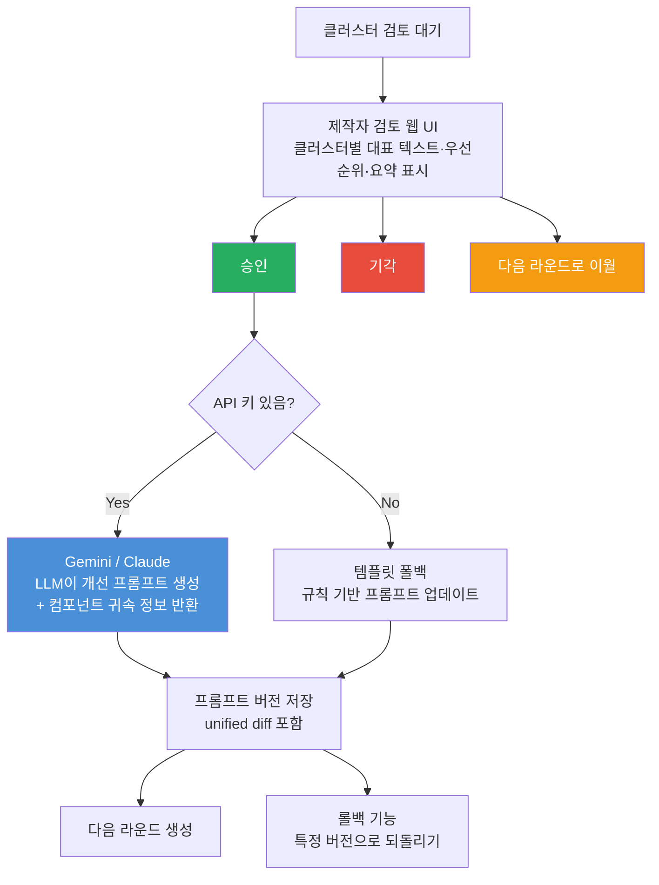
```mermaid
flowchart TD
    CR[클러스터 검토 대기] --> UI[제작자 검토 웹 UI\n클러스터별 대표 텍스트·우선순위·요약 표시]
    UI --> AP[승인]
    UI --> RJ[기각]
    UI --> DF[다음 라운드로 이월]

    AP --> LLM{API 키 있음?}
    LLM -->|Yes| CA["Gemini / Claude\nLLM이 개선 프롬프트 생성\n+ 컴포넌트 귀속 정보 반환"]
    LLM -->|No| TB["템플릿 폴백\n규칙 기반 프롬프트 업데이트"]
    CA & TB --> PV["프롬프트 버전 저장\nunified diff 포함"]
    PV --> NR[다음 라운드 생성]
    PV --> RB[롤백 기능\n특정 버전으로 되돌리기]

    style AP fill:#27AE60,color:#fff
    style RJ fill:#E74C3C,color:#fff
    style DF fill:#F39C12,color:#fff
    style CA fill:#4A90D9,color:#fff
```

### 컴포넌트 귀속 추적 (Component Attribution)

LLM이 프롬프트를 개선할 때, "어느 클러스터가 어느 컴포넌트를 어떻게 바꿨는지" 자동으로 기록합니다.

```json
[
  {"cluster_label": "BGM 볼륨 과다", "component": "audio", "change": "volume normalized to -14 LUFS"},
  {"cluster_label": "카메라 흔들림", "component": "camera", "change": "added steady tracking shot"},
  {"cluster_label": "자막 가독성", "component": "style", "change": "added subtitle-safe safe zone"}
]
```

버전 이력 화면에서 컴포넌트별 색상 배지와 상세 귀속 테이블로 시각화됩니다.

---

## 9. 멀티미디어 생성 파이프라인

영상 생성 외에도 BGM 믹싱, 자막 생성, 썸네일 추출, 음악 생성, 립싱크 생성 기능이 통합되어 있습니다. 각 기능은 관련 도구가 없어도 graceful fallback으로 동작합니다.

### BGM 믹싱 (3모드)

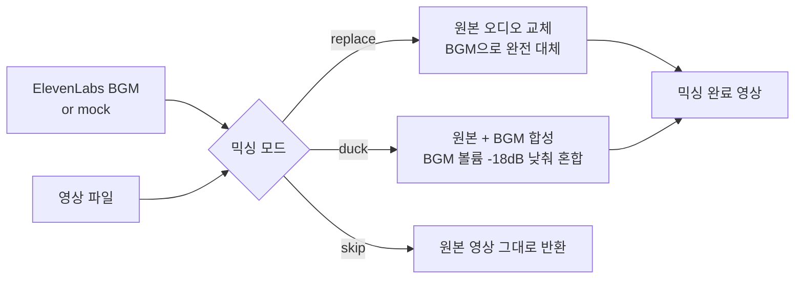
```mermaid
flowchart LR
    BGM[ElevenLabs BGM\nor mock] --> MODE{믹싱 모드}
    VM[영상 파일] --> MODE
    MODE -->|replace| R["원본 오디오 교체\nBGM으로 완전 대체"]
    MODE -->|duck| D["원본 + BGM 합성\nBGM 볼륨 -18dB 낮춰 혼합"]
    MODE -->|skip| S[원본 영상 그대로 반환]
    R & D --> OUT[믹싱 완료 영상]
```

### 자막 자동 생성 (Whisper)

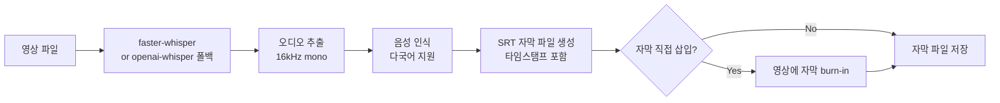
```mermaid
flowchart LR
    V[영상 파일] --> W["faster-whisper\nor openai-whisper 폴백"]
    W --> A["오디오 추출\n16kHz mono"]
    A --> T["음성 인식\n다국어 지원"]
    T --> S["SRT 자막 파일 생성\n타임스탬프 포함"]
    S --> B{자막 직접 삽입?}
    B -->|Yes| F["영상에 자막 burn-in"]
    B -->|No| DB[자막 파일 저장]
    F --> DB
```

### 썸네일 자동 추출

ffmpeg으로 영상을 균등 분할해 대표 프레임 3장을 자동 추출합니다. ffmpeg이 없으면 빈 목록 반환 (graceful fallback).

### 음악 생성 (싱잉홍보영상 전용)

| 어댑터 | 기능 | 조건 |
|--------|------|------|
| ElevenLabs Music | vocals + BGM 생성 | 유료 플랜 필요 |
| ElevenLabs Sound | BGM only | 무료 플랜 가능 |
| mock | 완료 처리만 | API 키 불필요 |

일일 최대 호출 수 초과 시 mock으로 자동 폴백.

### 립싱크 생성

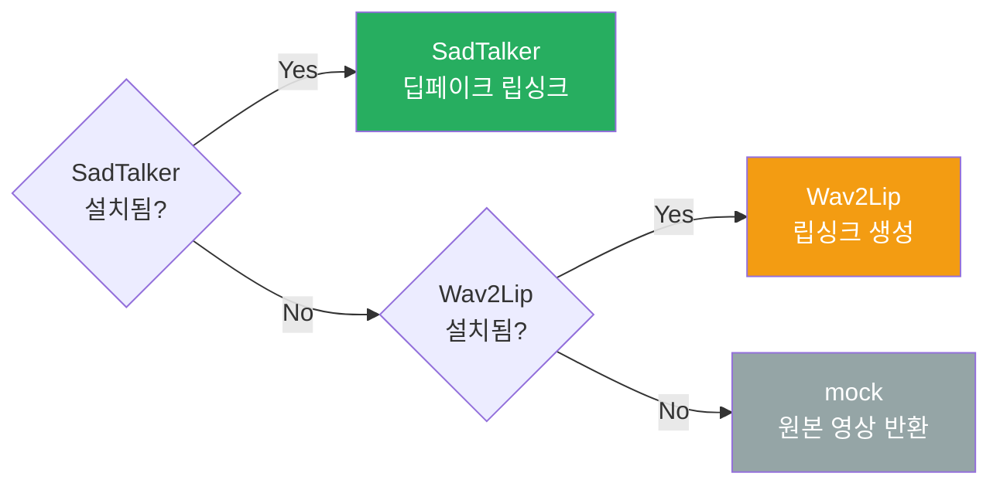
```mermaid
flowchart LR
    A{SadTalker\n설치됨?} -->|Yes| B[SadTalker\n딥페이크 립싱크]
    A -->|No| C{Wav2Lip\n설치됨?}
    C -->|Yes| D[Wav2Lip\n립싱크 생성]
    C -->|No| E[mock\n원본 영상 반환]

    style B fill:#27AE60,color:#fff
    style D fill:#F39C12,color:#fff
    style E fill:#95A5A6,color:#fff
```

---

## 10. 확장 기능 (F-1 ~ F-9)

핵심 파이프라인 외에 제작자 의사결정을 돕는 분석·자동화 기능이 구현되어 있습니다.

| 기능 | 설명 |
|------|------|
| F-1: 프롬프트 성능 이력 | 라운드별 건설적 피드백 비율 추이 시각화 |
| F-2: 실행가능성 점수 | 구체성·타당성·품질 가중 합산으로 실제 반영 가능성 정량화 |
| F-3: 참여도 향상 예측 | CUSUM 변형으로 다음 라운드 긍정 피드백 비율 예측 |
| F-4: 반복 이슈 분석 | 2개 이상 라운드에 재등장한 클러스터 분석 |
| F-5: 감정 드리프트 감지 | 댓글 부정 비율 급증 CUSUM 탐지 |
| F-7: A/B 프롬프트 변형 | 조명·속도·감정 3축으로 변형 자동 생성 |
| F-8: 댓글 답글 초안 | Gemini + 템플릿으로 한국어 답글 초안 자동 생성 |
| F-9: 채널 미적 지문 | OpenCV HSV 색상 분석으로 채널 일관성 편차 계산 |

### 피드백 ROI 시각화

연속 라운드 간 카테고리별 불만 건수를 비교해 개선율(녹색)/악화율(적색)을 막대 차트로 표시합니다. 피드백 반영이 실제로 효과가 있었는지 수치로 확인할 수 있습니다.

### 시청자 DNA / 채널 프로파일

세션 내 전 라운드 클러스터를 집계해 카테고리 분포(polarArea 차트)·재발 이슈·승인 이력을 종합 뷰로 제공합니다.

---

## 11. 보안 설계

| 위협 | 대응 방식 |
|------|----------|
| SSRF | 참조 이미지 URL 화이트리스트 + 내부 IP 차단 |
| 레이스 컨디션 | 영상 생성 상태 전환을 atomic UPDATE로 중복 방지 |
| 무단 접근 | 세션별 소유자 토큰 인증 (전 쓰기 라우트 적용) |
| 경로 탐색 | 파일 서빙 시 realpath + 허용 디렉토리 경계 검사 |
| CSRF | 모든 POST 폼에 JS 자동 토큰 주입 |
| 과다 요청 | API 비율 제한 (예측·생성 기능별 분당 최대 횟수) |
| XSS | innerHTML 대신 DOM 빌더 + DOMPurify 정화 |
| 프롬프트 인젝션 | 댓글을 XML 태그로 격리·승인 전 의심 패턴 자동 탐지 |
| 로그 키 노출 | 예외 로그에서 API 키·Bearer 토큰 자동 마스킹 |

---

## 12. 기술 스택 및 모델

모든 핵심 기능은 **로컬 CPU에서 실행**됩니다. GPU 불필요, 외부 계정 불필요(영상·음악 생성 API 제외).

| 구분 | 기술/모델 | 라이선스 | 크기 |
|------|-----------|---------|------|
| 피드백 분류 | paraphrase-multilingual-MiniLM-L12-v2 | Apache 2.0 | 118MB |
| 문장 임베딩 | paraphrase-multilingual-mpnet-base-v2 | Apache 2.0 | 278MB |
| 군집화 (우선) | HDBSCAN | BSD | — |
| 군집화 (예비) | sklearn AgglomerativeClustering | BSD | — |
| 음성→자막 | faster-whisper / openai-whisper | MIT | 244MB |
| 미적 지문 분석 | OpenCV | Apache 2.0 | — |
| 백엔드 | Python 3.11, Flask 3.x, SQLAlchemy | BSD/MIT | — |
| 보안 | flask-wtf, flask-limiter | MIT | — |
| 프론트엔드 | Bootstrap 5.3, Chart.js, DOMPurify | MIT | — |
| AI 영상 생성 (기본) | Google Veo 3.1 | 상용 (과금) | — |
| AI 영상 생성 (대체) | RunwayML Gen-3 | 상용 (과금) | — |
| 프롬프트 생성 (기본) | Google Gemini 2.0 Flash Lite | 상용 (무료 티어) | — |
| 프롬프트 생성 (대체) | Anthropic Claude Sonnet | 상용 | — |
| 음악 생성 | ElevenLabs Music/Sound | 상용 | — |
| 립싱크 생성 | SadTalker / Wav2Lip | MIT/Apache | — |

---

## 13. 직접 설계·구현한 핵심 모듈

오픈소스 라이브러리(임베딩 모델, HDBSCAN, sklearn 등)는 기반 도구로 활용하고, 아래 핵심 로직은 팀이 직접 설계·구현했습니다.

```mermaid
mindmap
  root((팀 직접 구현))
    분류기
      원형 코사인 유사도 분류기
      6축 + 실행가능성 평가 로직
      지수이동평균 온라인 학습
      다중 레이블 주제 감지 최대 3개
      저작권·부적절 콘텐츠 선(先) 필터
      간접 프롬프트 인젝션 감지
    클러스터링
      2단계 파이프라인 주제 태깅 → 군집화
      카테고리별 적응형 거리 임계값
      품질 가중 대표 텍스트 선정
      응집도 점수 계산
      추출 요약 생성
      대형 클러스터 자동 분할
    우선순위
      5축 가중 공식
      재발 부스트 라운드별 이력 추적
      상반된 피드백 페널티
    영상·미디어 생성
      Veo 3.1 어댑터 3단계 파이프라인
      Veo Extend 체인 연장 최대 148초
      RunwayML 어댑터 3단계 파이프라인
      BGM 믹싱 3모드
      ffmpeg 썸네일 자동 추출
      Whisper SRT 자막 자동 생성
    음악·립싱크
      ElevenLabs 음악 어댑터 체인
      SadTalker → Wav2Lip 자동 폴백
      일일 유료 호출 안전장치
    워크플로
      승인 검토 UI
      프롬프트 버전 관리 및 롤백
      unified diff 저장
      컴포넌트 귀속 추적 자동화
      전역 기술 설정 승격
      좀비 상태 자동 복구
    확장 기능
      F-3 CUSUM 참여도 향상 예측
      F-4 크로스라운드 반복 이슈 분석
      F-5 CUSUM 감정 드리프트 감지
      F-7 A/B 프롬프트 3축 자동 변형
      F-8 Gemini 댓글 답글 초안 생성
      F-9 OpenCV 채널 미적 지문
      피드백 ROI 시각화
      시청자 DNA 채널 프로파일
    보안
      CSRF 전면 보호
      SSRF 방지
      레이스 컨디션 방지
      세션 소유자 인증
      경로 탐색 방지
      API 키 마스킹
      LLM 입력 격리
```

---

## 14. 구현 완성도

| 기능 | 상태 |
|------|------|
| 피드백 수집 (시뮬레이션 / YouTube API) | ✅ 완료 |
| 저작권·부적절 콘텐츠 선(先) 필터 | ✅ 완료 |
| 6축 + 실행가능성 피드백 분류 | ✅ 완료 |
| 원형 코사인 유사도 분류기 (온라인 학습) | ✅ 완료 |
| HDBSCAN + 카테고리별 적응형 임계값 클러스터링 | ✅ 완료 |
| 대형 클러스터 자동 서브클러스터링 | ✅ 완료 |
| 5축 우선순위 산정 (재발 부스트·페널티 포함) | ✅ 완료 |
| 클러스터 응집도·추출 요약 자동 생성 | ✅ 완료 |
| 제작자 검토 웹 UI (승인·기각·이월) | ✅ 완료 |
| 프롬프트 버전 관리 + 롤백 | ✅ 완료 |
| 컴포넌트 귀속 추적 자동화 | ✅ 완료 |
| 분석 리포트 (Chart.js, 피드백 ROI) | ✅ 완료 |
| Veo 3.1 영상 생성 어댑터 | ✅ 완료 |
| Veo Extend (최대 148초 체인 연장) | ✅ 완료 |
| RunwayML 영상 생성 어댑터 | ✅ 완료 |
| 일일 유료 호출 안전장치 | ✅ 완료 |
| Gemini 프롬프트 생성 (무료 티어) | ✅ 완료 |
| Claude 프롬프트 생성 (폴백) | ✅ 완료 |
| 직접 프롬프트 입력 (AI 생성 건너뜀) | ✅ 완료 |
| 장르 프리셋 (6종 + 싱잉홍보영상) | ✅ 완료 |
| BGM 믹싱 3모드 (replace / duck / skip) | ✅ 완료 |
| Whisper SRT 자막 자동 생성 | ✅ 완료 |
| ffmpeg 썸네일 자동 추출 | ✅ 완료 |
| ElevenLabs 음악 생성 (싱잉홍보영상) | ✅ 완료 |
| SadTalker / Wav2Lip 립싱크 생성 | ✅ 완료 |
| 좀비 상태 자동 복구 | ✅ 완료 |
| SSE 실시간 생성 상태 스트리밍 | ✅ 완료 |
| F-1: 프롬프트 성능 이력 | ✅ 완료 |
| F-2: 실행가능성 점수 | ✅ 완료 |
| F-3: 참여도 향상 예측 | ✅ 완료 |
| F-4: 크로스-라운드 반복 이슈 분석 | ✅ 완료 |
| F-5: 감정 드리프트 감지 | ✅ 완료 |
| F-7: A/B 프롬프트 자동 변형 | ✅ 완료 |
| F-8: 댓글 답글 초안 자동 생성 | ✅ 완료 |
| F-9: 채널 미적 지문 | ✅ 완료 |
| 시청자 DNA 채널 프로파일 | ✅ 완료 |
| Before/After 영상 나란히 비교 | ✅ 완료 |
| YouTube 메타데이터 자동 생성 | ✅ 완료 |
| 피드백 반응 예측 | ✅ 완료 |
| CSRF 전면 보호 | ✅ 완료 |
| API 비율 제한 | ✅ 완료 |
| SSRF / 레이스 컨디션 / 경로 탐색 / 소유자 인증 | ✅ 완료 |
| API 키 마스킹 + 프롬프트 인젝션 감지 | ✅ 완료 |
| XSS 방지 (DOMPurify + DOM 빌더) | ✅ 완료 |
| 다크 모드 + 키보드 단축키 | ✅ 완료 |
| 실제 YouTube 업로드 연동 | 🔲 미테스트 |
